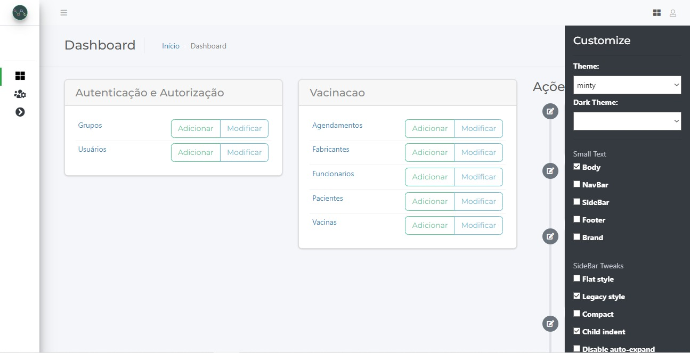
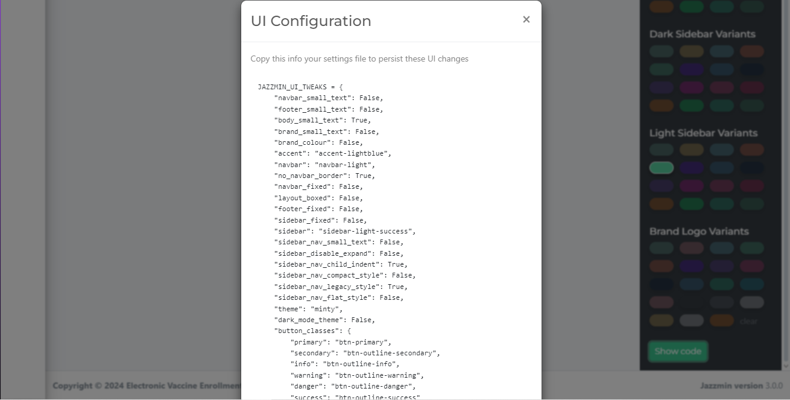

# Documentação da Aplicação de Agendamento de Vacinação

<picture>
    <source media="(prefers-color-scheme: dark)" srcset="https://user-images.githubusercontent.com/25423296/163456776-7f95b81a-f1ed-45f7-b7ab-8fa810d529fa.png">
</picture>
## Bem vindo ao EVE!
### Electronic Vaccine Enrollment (EVE)

## Descrição
EVE foi desenvolvido em Python utilizando o framework Django, tem como objetivo facilitar o agendamento de vacinação. O banco de dados PostgreSQL armazena informações sobre pessoas, funcionários, vacinas e agendamentos. A interface administrativa é personalizada com o template Jazzmin para uma melhor experiência do usuário.

## Tecnologias
* Python
* Django
* PostgreSQL
* Jazzmin

## Instalação
 * Clone este repositório: 
    > https://github.com/FE3Ky/MPOO_Project-2024.1
 * Crie um ambiente virtual e ative-o.
 * Instale as dependências: pip install -r requirements.txt

## Execução
 * Crie um arquivo .env utilizando o arquivo .env.example
 * Execute as migrações: python manage.py migrate
 * Inicie o servidor de desenvolvimento: python manage.py runserver
 * Crie um usuario admin com o comando: python manage.py createsuperuser

## Acesso ao Admin:
Acesse o Django Admin em: 
> http://127.0.0.1:8000/admin/

## Modelos de Dados:
1. Pessoa: Informações básicas de uma pessoa 
    * nome, cpf, data de nascimento, sexo e endereço completo
2. Funcionario: Informações específicas de um funcionário, também herda de Pessoa 
    * nome, cpf, data de nascimento, sexo, cnes e endereço completo
3. Vacina: Informações sobre a vacina 
    * tipo, lote, validade e fabricante
4. Agendamento: Relaciona uma pessoa a uma vacina em uma determinada data e horário
    * paciente, vacina, data e status
5. Fabricante: Informações sobre o fabricante da vacina
    * nome e cnpj 
6. Paciente: Herda de Pessoa e possui informações adicionais sobre o paciente 
    * nome, cpf, data de nascimento, sexo, sus e endereço completo

## Funcionalidades:
 * Cadastro: Permite cadastrar pessoas, funcionários, vacinas e fabricantes.
 * Agendamento: Permite agendar vacinas para pacientes.
 * Consulta: Permite consultar agendamentos e informações sobre pacientes e vacinas.
 * Jazzmin: A interface administrativa foi personalizada, oferecendo uma experiência visual mais agradável e intuitiva.

## Personalização
Para personalizar a interface Jazzmin, basta ir ao ícone na parte superior direita, selecionando todas as opções possíveis. Ao final, basta gerar o código e colar no arquivo settings.py.

## Licença:
Este projeto está licenciado sob a licença MIT.

